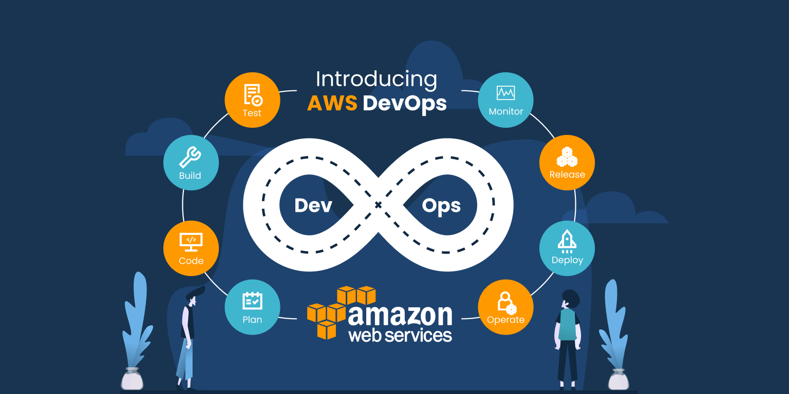

# DevOps & AWS recording

### What, Why and Benefits of DevOps
#### What is it?

- Bring the gap between development and operations hence the name
- DevOps is a set of tools, practices and culture philosophy
- Incorporates AGILE methodology emphasis on cross-team communication, collaboration.
- big part of their role is to help with automation

#### why and the benefits

- Helps a business from all aspects (profits, expenditure, insights)
- For software development improves speed and stability, incorporates CI/CD
- Enables you to focus on the main goal: People

### role of DevOps
The role of a DevOps engineer will vary from one organization to another, but invariably entails some 
combination of: 
- release engineering,
- infrastructure provisioning and management,
- system administration, 
- security,
- DevOps advocacy.

### Cloud computing and AWS

- accessing on-demand IT services over the internet, pay-to-go model. Features like storage,
 power and databases.
- aws is a certain provider for these services, one of the biggest. many access points over the world
### How cloud computing fits into DevOps 

- Facilitates alot of the goals a devops engineer is trying to achieve, helps scalability. 
- Allows a unified platform for 
tasks like deploying, testing, integrating and releasing.

### Benefits of cloud computing and use cases 

- Agility (services can be accessed almost instantly)
- Elasticity (Can scale resources easily and efficiently)
- Cost-effective (only pay for what you need)
- Deploy Globally (application can be accessed almost anywhere)

##### Use Cases

- Airbnb (uses it to spread site traffic across servers, process and analyse searches, use is to house backup files and 
property images)

- Netflix (from video transcoding and recommendation engines to database storage 
and customer analytics, nearly all of Netflix operations leverage AWS products.)